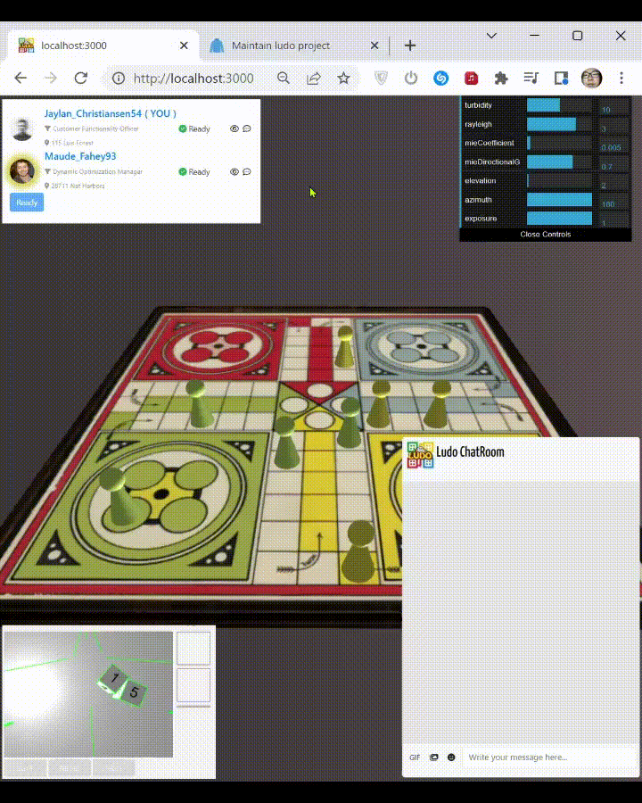

# Getting Started

## Description

- A 3D online game, built upon Three.js (Rendering) and Cannon-es (Physics)
- Using Colyseus for syncing game states through sockets

## How to run

### 1. Frontend

- This repo

```bash
  npm run live
```

### 2. Backend
- [Socket repo](https://github.com/Howard-O-Neil/ludo-colyseus)
- [Rest services repo](https://github.com/Howard-O-Neil/ludo-py)

```bash
  # For both 2 backend repo
  docker-compose up -d

  # For Rest services repo
  # Migrate db schema
  flask db upgrade
```

> **Note**  
> Socket default port   = 2567  
> Backend default port  = 8083  
> If you changed, reconfigure in the frontend `.env` file

## Short demo

